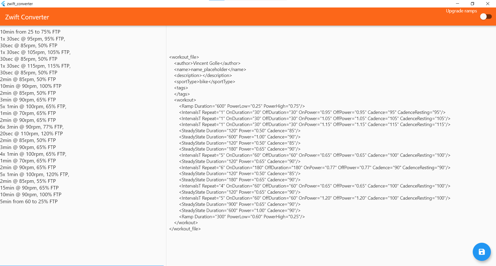

# zwift_converter

This converter is a tool for converting textual workouts to a Zwift .zwo format.  

[https://whatsonzwift.com/workouts](https://whatsonzwift.com/workouts)



## Installing from MSIX installer

First you'll need to install the certificate.  
For that, please follow the instructions at the following link:  


Then you can install the program:  
.\build\windows\runner\Release\zwift_converter.msix

## Creating a MSIX installer

- flutter clean
- flutter pub get
- flutter build windows
- flutter pub run msix:create

### Creating a certificate

On Windows, please install OpenSSL first:  
https://slproweb.com/products/Win32OpenSSL.html

```
openssl genrsa -out myrsakey.key 2048
openssl req -new -key myrsakey.key -out mycsrkey.csr
openssl x509 -in mycsrkey.csr -out mycrtakey.crt -req -signkey myrsakey.key -days 600
openssl pkcs12 -export -out CERTIFICATE.pfx -inkey myrsakey.key -in mycrtakey.crt
```
